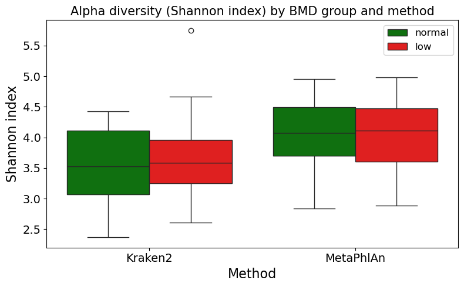
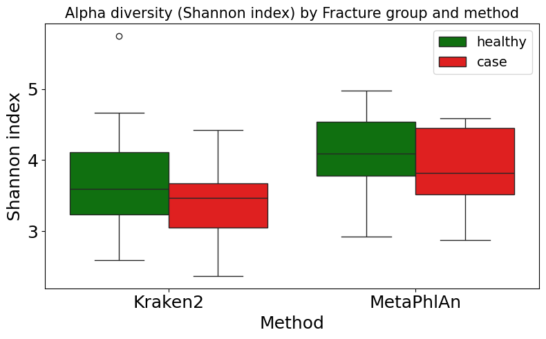
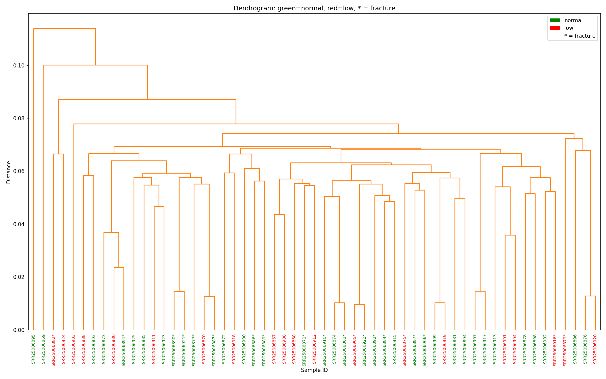
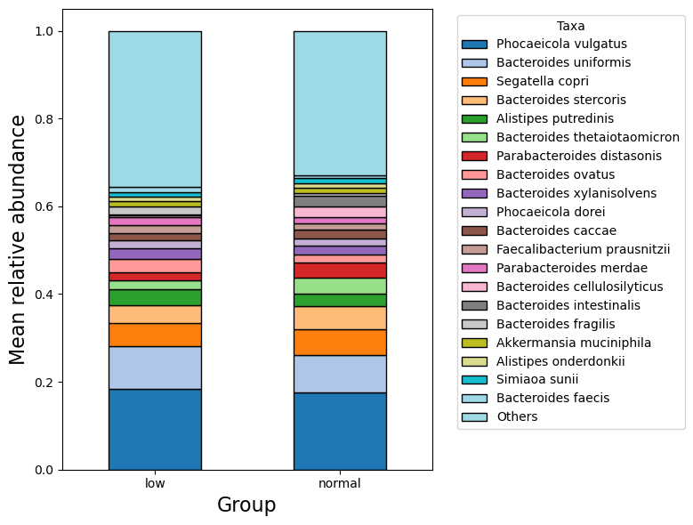
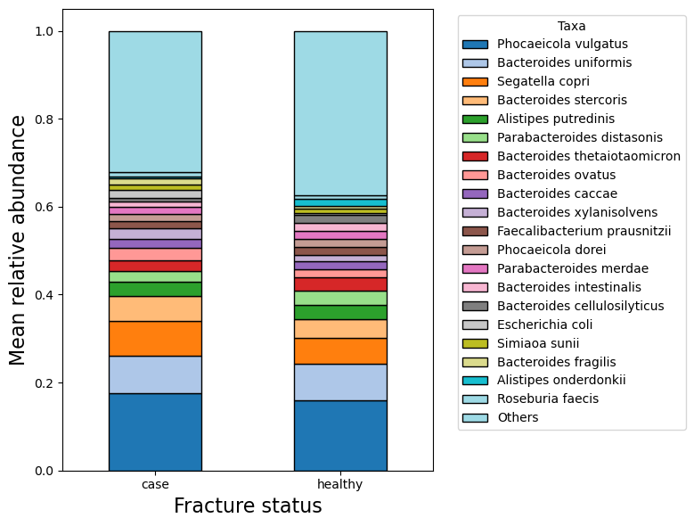

# HiddenMicrobiome

**Exploring the hidden diversity of the gut microbiome to discover diagnostic markers for osteoporosis disease classification using whole-genome sequencing (WGS) data.**

---

# Repository structure

- **`pipeline/`** – All executable scripts (Bash and Python), organised by steps:
  - 00_preprocessing/ – download, QC, trimming, BMD calculation.
  - 01_taxonomic_annotation/ – Kraken2, MetaPhlAn, PCA, t‑SNE, alpha diversity.
  - 02_kmer_mash/ – MetaFX (k‑mer features), Mash distances, dendrogram.
  - 03_validation/ – train/test split, Random Forest, external validation.
- **`notebooks/`** – Jupyter notebooks with step‑by‑step instructions and figure previews:
  - 00_preprocessing.ipynb
  - 01_taxonomic_annotation.ipynb
  - 02_metafx_mash.ipynb
  - 03_validation.ipynb
- **`images/`** – All figures generated during the analysis (PNG files).
- **`About_dataset.md`** – Detailed description of the public dataset.
- **`requirements.txt`** – Python dependencies for local analysis.
- **`README.md`** – Project overview, objectives, results.
- **`Steps_backup/`** – Archived notebooks, kept for reference; not required for running the pipeline.

---

#  About the Project

The human gut microbiome harbors a vast diversity of microorganisms, many of which are difficult to detect with conventional methods. This project aims to uncover **hidden microbial signatures** associated with various diseases (e.g. osteoporosis) using whole-genome shotgun sequencing data. 

By integrating taxonomic, functional, and k‑mer‑based analyses, we attempt to identify subtle patterns that can robustly differentiate between healthy and diseased individuals. The ultimate goal is to discover potential diagnostic markers for human diseases.

The pipeline is implemented primarily in **Bash** and **Python** (for data processing, statistical analysis, and machine learning).

---

# Goals And Objectives

- **Goal:** Identify robust diagnostic markers from human gut WGS samples for disease classification.
- **Objectives:**
  - Literature review of existing microbiome‑disease associations.
  - Selection and preprocessing of public WGS datasets.
  - Extraction of significant features via:
    - **Taxonomic profiling** (Kraken2, MetaPhlAn)
    - **k‑mer based feature extraction** (MetaFX) 
    - **Genomic distance estimation** (Mash)
  - Training and evaluation of classification models.
  - Development of a reproducible, modular analysis pipeline.
  - Annotation and biological interpretation of identified markers.

---

# Datasets

Currently, the project focuses on the following datasets:

*(more details about dataset and original publication in [About_dataset.md](About_dataset.md))*
- **Osteoporosis study**  
  - 56 human (female) gut microbiome samples from a public US database.  
    - 20 cases (with fracture), 37 healthy (without fracture).  
    - 20 cases (with osteoporosis or osteopinia), 37 healthy (without osteoporosis or osteopinia)
    
   Data preprocessing and feature extraction steps are described in the notebooks: [notebooks/00_preprocessing.ipynb](notebooks/00_preprocessing.ipynb) and [notebooks/01_taxonomic_annotation.ipynb](notebooks/01_taxonomic_annotation.ipynb).

- **Result validation**  
    - To evaluate the predictive performance of the models, the labeled cohort (56 samples) was split into *training (44 samples)* and *test (12 samples)* sets.  
       - The test set contained 4 low-BMD samples and 8 normal-BMD samples.

  **Bone Mineral Density (BMD)** – a measure of bone strength and a key indicator for diagnosing osteoporosis

    - Two approaches were compared:
        1. **Kraken2** – taxonomic profiling, filtering of taxa present in <5% of samples.
        2. **MetaFX with preprocessing** – filtering of k‑mers present in <5% of training samples.

   - **External validation on an independent arthritis cohort**  
     To test the k‑mer‑based markers generalise to a different bone‑related pathology, we applied the same feature extraction pipeline to FASTQ files from a [colleague's arthritis study](https://github.com/dar1a-da/HiddenMicrobiota/tree/dev). The Random Forest model trained on the osteoporosis training set was then used to predict disease status. 

---

# Prerequisites

- **Python 3.8+** with packages: `pandas`, `numpy`, `scikit-learn`, `matplotlib`, `seaborn`, etc (see [requirements.txt](requirements.txt))/
- **Bash** environment (Linux / macOS / WSL)
- External tools: [FastQC](https://github.com/s-andrews/fastqc), [Trimmomatic](https://github.com/usadellab/trimmomatic), [Kraken2](https://github.com/DerrickWood/kraken2)  , [MetaPhlAn4](https://github.com/biobakery/MetaPhlAn) , [MetaFX](https://github.com/ctlab/metafx) , [Mash](https://mash.readthedocs.io/en/latest/)  (see their respective installation guides)

---

# Pipeline Overview

1. **Quality control** – `FastQC` (scripts in [pipeline/00_preprocessing/](/pipeline/00_preprocessing/))
2. **Trimming** – `Trimmomatic` (same folder)
3. **Taxonomic profiling** – `Kraken2` and `MetaPhlAn4` (scripts in [pipeline/01_taxonomic_annotation/](/pipeline/01_taxonomic_annotation/))
4. **Feature extraction**
   - taxonomic abundances (`Kraken2`, `MetaPhlAn4`) → [01_taxonomic_annotation/analysis_local.py](/pipeline/01_taxonomic_annotation/analysis_local.py)
   - k‑mer features (`MetaFX`) → [pipeline/02_metafx_mash/](/pipeline/02_metafx_mash/)
5. **Genomic distance estimation** – `Mash` → [pipeline/02_metafx_mash/run_mash.sbatch](/pipeline/02_metafx_mash/run_mash.sbatch)
6. **Statistical analysis & visualisation** – PCA, t‑SNE, alpha diversity, beta diversity, mean relative abundance → generated by [analysis_local.py](/pipeline/01_taxonomic_annotation/analysis_local.py) and [plot_dendrogram.py](/pipeline/02_metafx_mash/plot_dendrogram.py)
7. **Machine learning** – Random Forest (`scikit‑learn` and `MetaFX`) → [pipeline/03_validation/](/pipeline/03_validation/)
8. **Marker interpretation** – BLAST annotation of top‑ranked contigs (results in README and Zenodo)

For detailed instructions, open the corresponding Jupyter notebook in the [notebooks/](/notebooks/) folder.

---

# Results

## Alpha and beta diversity analysis

To assess whether global microbial community structure differs between disease groups, we calculated **alpha diversity** (Shannon index) and **beta diversity** (Mash distances, Jaccard index) using both Kraken2 and MetaPhlAn taxonomic profiles.

- **Alpha diversity (Shannon index):** did not reveal any statistically significant differences between healthy and diseased individuals (neither for BMD nor for fracture groups), regardless of the annotation method (Kraken2 or MetaPhlAn). 

    However, the observed trends were method‑dependent: while Kraken2 showed a non‑significant tendency towards lower diversity in cases (qualitatively consistent with the concept of dysbiosis), MetaPhlAn exhibited a slight, non‑significant increase in diversity in the low‑BMD group. 
    
    This methodological discrepancy likely reflects the intrinsic differences between the two tools – Kraken2 is a k‑mer‑based classifier sensitive to rare and non‑bacterial sequences, whereas MetaPhlAn relies on strict marker genes and therefore captures only well‑annotated bacterial diversity.

- **Beta diversity (Mash):** Principal coordinate analysis of Mash distances did not reveal any clear clustering by bone density or fracture status. This is consistent with the observation that mean relative abundances of individual taxa showed largely indistinguishable profiles between health and disease. The lack of clustering likely reflects the high heterogeneity of gut microbiota among patients with low BMD or fractures.

Thus, standard diversity metrics alone are insufficient to discriminate the groups, motivating the use of machine learning approaches on k‑mer‑derived features.

---

## BMD
**Mean relative abundance Kraken2 annotation results**

The stacked bar chart of the top‑20 most abundant taxa (plus "Others") revealed a broadly similar distribution between the low and normal BMD groups. No dramatic differences in the relative contribution of the major taxa were observed; both groups shared a comparable set of dominant species, with only minor variations in their mean abundances. This suggests that at the level of overall taxonomic composition, the two BMD groups are qualitatively similar, and any potential microbiome differences may reside in rarer or unannotated taxa rather than in the most abundant species.

**Table: Top discriminatory contigs between normal and low bone density groups identified by Random Forest (MetaFX results)**

 - The k‑mers that were most important for the Random Forest model (trained on MetaFX features) were assembled into contigs. Each contig was then aligned against the NCBI nucleotide (nt) and protein (nr) databases using blastn and blastx. The best hits are reported in the tables below. This procedure identifies not only taxonomic labels but also putative functions encoded on the discriminatory sequences.

| Sequence ID | Predicted bacterium | Predicted gene/protein | Function / role | Reference  |
|-------------|---------------------|------------------------|----------------|---------------------|
| `low_238` | *Ruthenibacterium lactatiformans* | Sulfatase-like hydrolase/transferase (WP_288694885.1) | Cleavage of sulfated compounds; potential pathogen associated with vertebral osteomyelitis and bacteremia (first human case reported in 2024) | [PMC11247725](https://pmc.ncbi.nlm.nih.gov/articles/PMC11247725/) |
| `low_340` | *Caproiciproducens lactatisolvens* | Not specified (16S rRNA) | Caproic acid production; no established link to bone pathology (found in a patient with low bone density) | [PMC7873966](https://pubmed.ncbi.nlm.nih.gov/33584563/) |
| `normal_602` | *Bacteroides finegoldii* | Transmembrane permease (DMT family); putative transmembrane permease (CDA85058.1) | Hyaluronic acid degradation to oligosaccharides, potentially beneficial for joint and skin health; normal commensal | [PMID 36586473](https://pubmed.ncbi.nlm.nih.gov/36586473/) |
| `low_605` | *[Clostridium] leptum* (metagenome-assembled) | Histidine kinase sensor (MFQ9845483.1) | Two-component signal transduction system, adaptation to stress/nutrients; May be related to osteoporosis, as these bacteria produce short-chain fatty acids (SCFAs) that are good for bones. | [Lyu et al., 2023](https://www.nature.com/articles/s41413-023-00264-x) |

---

*For a complete list of top‑20 contigs, please refer to [top20_bmd.fasta](https://zenodo.org/records/20325514/files/top20_bmd.fasta?download=1) in the repository.*

## Fracture
**Mean relative abundance on Kraken2 annotation results**

The stacked bar chart revealed a broadly similar distribution of major taxa between individuals with and without fractures, with both groups sharing a comparable set of dominant species.Individuals with fractures have a few dominant species account for a larger proportion of the microbial community, whereas in those without fractures, the abundance is more evenly distributed among a greater number of taxa, resulting in a larger "Others" segment. These differences, while not dramatic, may point to a less diverse or more uneven community structure associated with fracture status.

**Table: Top discriminatory contigs between normal and low bone density groups identified by Random Forest (MetaFX results)**

- The k‑mers that were most important for the Random Forest model (trained on MetaFX features) were assembled into contigs. Each contig was then aligned against the NCBI nucleotide (nt) and protein (nr) databases using blastn and blastx. The best hits are reported in the tables below. This procedure identifies not only taxonomic labels but also putative functions encoded on the discriminatory sequences.

| Sequence ID | Predicted bacterium | Predicted gene/protein | Function / role | Reference |
|-------------|---------------------|------------------------|----------------|-----------|
| `case_474` | *Mediterraneibacter massiliensis* | GTPase ObgE (WP_117993920.1) | P-loop GTPase involved in ribosome assembly, cell cycle, cell wall synthesis, and stress response. Isolated from faeces of an obese patient. No direct link to bone pathology. | [PMID 29855844](https://pubmed.ncbi.nlm.nih.gov/29855844/) |
| `case_263` | *Bacteroides luhongzhouii* and *Bacteroides zhangwenhongii* (two novel species) | not specified (16S rRNA identification) | New species of genus *Bacteroides* isolated from faeces of healthy humans. Typical gut commensals, no signs of pathogenicity. | [CP182860](https://www.ncbi.nlm.nih.gov/nucleotide/CP182860.1) (species description) |
| `case_90` | *Bacteroides* sp. A1C1 (species not determined) | not specified | Gram-negative anaerobic rod isolated from cat faeces. Likely incidental detection; clinical significance for humans unclear. | [PRJNA522935](https://www.ncbi.nlm.nih.gov/bioproject/PRJNA522935) |
| `case_108` | *Bacteroides thetaiotaomicron* | ATP-dependent zinc metalloprotease FtsH (CAK7001341.1) | Universal protease essential for cell division, stress resistance, and membrane homeostasis. Key gut commensal, beneficial for polysaccharide breakdown. | [PMC9020784](https://pmc.ncbi.nlm.nih.gov/articles/PMC9020784/) |
| `case_22` | *Phocaeicola vulgatus* (formerly *Bacteroides vulgatus*) | not specified | Candidate strain NB1000S for treatment of hyperoxaluria (oxalate reduction). May indirectly affect calcium metabolism, but no direct bone link proven. | [PRJNA1211572](https://www.ncbi.nlm.nih.gov/bioproject/PRJNA1211572) |
| `case_16` | *Bacteroides ovatus* | not specified | Typical gut commensal involved in dietary fibre fermentation. Neutral microorganism, not associated with bone pathology. | [CP134818](https://www.ncbi.nlm.nih.gov/nucleotide/CP134818.1) |

### conclusion for the top‑contig tables

Analysis of the most informative contigs identified by the Random Forest model (trained on MetaFX k‑mer features) revealed several microorganisms potentially associated with bone pathologies.

In **the low‑BMD group**, the most notable finding was contig low_238, annotated as *Ruthenibacterium lactatiformans*. This bacterium was first described in 2024 in a patient with vertebral osteomyelitis, suggesting a possible role in bone tissue infection. Other contigs, such as low_605 (*Clostridium leptum*), are linked to short‑chain fatty acid production, which may influence bone metabolism. In contrast, contig normal_602 (*Bacteroides finegoldii*) was associated with the healthy group, consistent with its anti‑inflammatory properties.

In **the fracture (case) group**, none of the identified contigs showed a direct association with osteomyelitis or bone resorption. The dominant bacteria belong to the genus Bacteroides (*B. luhongzhouii*, *B. zhangwenhongii*, *B. thetaiotaomicron*, *B. ovatus*, *Phocaeicola vulgatus*). These taxa are common gut commensals and are generally not considered pathogenic. The presence of *Mediterraneibacter massiliensis* and *Pedobacter sp.* requires further investigation, but their role in osteoporosis pathogenesis remains unclear.

**Key difference between the two analyses:** the model trained on low bone mineral density (BMD) identified a specific pathogen (*R. lactatiformans*), whereas the fracture‑trained model did not find such markers. This may reflect different etiologies – low BMD may be driven partly by microbial factors, while fractures are likely determined by a complex mix of mechanical and non‑microbial causes.

Thus, the identified contigs serve as candidate markers for further studies on the role of the gut microbiota in osteoporosis, but they require validation in larger, more homogeneous cohorts.

---
*For a complete list of top‑20 contigs, please refer to [top20_fracture.fasta](https://zenodo.org/records/20325514/files/top20_fracture.fasta?download=1) in the repository.*

### why the tables differ between BMD and Fracture analyses?

The sets of discriminatory contigs differ because the models were trained on different response variables:

**BMD analysis** – low vs normal bone mineral density.

**Fracture analysis** – case (fracture) vs healthy (no fracture).

The groups did not match between the analyses: low BMD was not always associated with fractures, and the datasets were partly distinct. In subsequent work, we focused on the BMD analysis, considering this trait more relevant for studying osteopenia and osteoporosis. Although the underlying microbial communities overlap, the most informative k‑mers vary with the clinical definition of the outcome. Therefore, the two tables highlight different microbial signatures.

---

## Validation results 

Using MetaFX on all 56 samples, we extracted 9035 k‑mer‑based features. A Random Forest classifier was then trained to discriminate between normal and low‑BMD samples using 5‑fold cross‑validation. The model achieved a mean accuracy of 89.4% (±0.038). To obtain a more realistic estimate of generalisation performance, we additionally performed a train/test split (44/12) and evaluated the model on the unseen test set.

| Method | Accuracy | Recall (low) | Precision (low) | Correct low (out of 4) | Correct normal (out of 8) |
|--------|----------|--------------|----------------|------------------------|---------------------------|
| Kraken2 | **0.833** (10/12) | 0.50 | 1.00 | 2 | 8 |
| MetaFX  | 0.750 (9/12) | 0.25 | 1.00 | 1 | 8 |

### External validation on an independent arthritis cohort

The Random Forest model trained on the osteopinia training set correctly classified 80% of the arthritis samples (as healthy), indicating a good ability to discriminate health vs disease across different skeletal disorders. 

This result supports the potential of the identified k‑mer signatures as general markers of bone/joint pathology, although further validation on larger and more homogeneous cohorts is needed.

### Detailed error analysis

- **Kraken2** misclassified two low‑BMD samples as normal: `SRR25006884` and `SRR25006909`. It correctly predicted `SRR25006887` and `SRR25006893`.
- **MetaFX + preprocessing** misclassified three low‑BMD samples (`SRR25006884`, `SRR25006887`, `SRR25006909`) and correctly predicted only `SRR25006893`.
- **Both methods** made identical errors on `SRR25006884` and `SRR25006909`, and both correctly identified `SRR25006893`.
- All normal samples were correctly predicted by every method.

Given the small test set (only 4 low‑BMD samples), the difference of 1–2 correctly predicted samples is not statistically significant.  
Thus, the performance of **Kraken2** and **MetaFX with preprocessing** is **comparable**, and the preprocessing step substantially improved MetaFX (accuracy rose from 66.7% to 75%, enabling detection of at least one low‑BMD sample).

The consistently misclassified low‑BMD samples (`SRR25006884` and `SRR25006909`) might have bone density reduction driven by non‑microbiome factors (e.g., genetic connective tissue disorders), which warrants further clinical investigation.

### MetaFX Top‑20 contigs discriminating low/normal groups (trained on the training set)

Using the Random Forest model from **MetaFX with preprocessing**, the most important features (k‑mers assembled into contigs) were extracted and annotated via BLAST. Selected results are shown below; the full list of 20 contigs is available in Supplementary Materials.

| Sequence ID | Predicted taxon | Predicted gene/protein | Function / role | Reference |
|-------------|----------------|------------------------|----------------|-----------|
| `low_305` | *Ruthenibacterium lactatiformans* | not specified | Cleavage of sulfated compounds; potential pathogen associated with vertebral osteomyelitis and bacteremia | [PMC11247725](https://pmc.ncbi.nlm.nih.gov/articles/PMC11247725/) |
| `low_27` | *Bacteroides ovatus* (chromosome CP103080.1) | LTA synthase family protein | Commensal with immunomodulatory properties; role in bone density unclear | [BLAST](https://www.ncbi.nlm.nih.gov/nucleotide/CP103080.1) |
| `low_701` | *Pilosibacter sp.* (CP175657.1) | AEC family transporter | Gut commensal; no direct bone link | [BLAST](https://www.ncbi.nlm.nih.gov/nucleotide/CP175657.1) |
| `low_87` | *Dorea longicatena* | MptD family putative ECF transporter S component [Dorea]| Ferments carbohydrates → short‑chain fatty acids; associated with increased muscle mass and bone mineral density in the HUNT cohort (2023) | [MDPI Nutrients 13(6):2032](https://www.mdpi.com/2072-6643/13/6/2032); [Nat Commun 14, 2250 (2023)](https://www.nature.com/articles/s41467-023-37978-9) |
| `normal_613` | *Bacteroides finegoldii* | translocation/assembly module TamB domain-containing protein, partial| Commensal with anti‑inflammatory properties; strengthens intestinal barrier, reduces pro‑inflammatory cytokines (IL‑6, TNF‑α, IL‑1β), and suppresses NF‑κB and MAPK pathways; may contribute to normal bone density via systemic anti‑inflammatory effects| [PMC12442397](https://pmc.ncbi.nlm.nih.gov/articles/PMC12442397/); [AEM.00891-25](https://journals.asm.org/doi/full/10.1128/aem.00891-25) |

### Biological interpretation

The presence of *Dorea longicatena* (contig `low_87`) is particularly interesting because this species shows a paradoxical role: it has been positively associated with bone mineral density and muscle mass, but also linked to obesity and colorectal cancer.  
This suggests that the low‑BMD patient group is microbially heterogeneous, which could explain why some low‑BMD samples were misclassified by both methods.

---

*For a complete list of top‑20 contigs, please refer to [top20_contigs_metafx_preproc.fasta](https://zenodo.org/records/20325514/files/top20_contigs_metafx_preproc.fasta?download=1) in the repository.*

### Kraken2 Top‑10 taxa discriminating low/normal groups (trained on the training set)

The table below shows the top‑10 most important features (taxa) from the Random Forest classifier trained on Kraken2 species‑level relative abundances. 

| Taxon | Importance (Gini) |
|-------|------------|
| *Clostridium saccharoperbutylacetonicum* | 0.013596 |
| *Clostridium gelidum* | 0.011232 |
| *Macellibacteroides fermentans* | 0.010464 |
| *Methylophaga nitratireducenticrescens* | 0.009682 |
| *Pedobacter* sp. MW01-1-1 | 0.009170 |
| *Spinacia oleracea* (spinach) | 0.007887 |
| *Heyndrickxia oleronia* | 0.007867 |
| *Clostridium kluyveri* | 0.007701 |
| *Gilliamella* sp. ESL0443 | 0.007326 |
| *Nocardioides campestrisoli* | 0.007214 |

All importance scores are low (<0.014), suggesting that no single taxon dominates classification. *Spinacia oleracea* (spinach) is likely a contaminant or misassignment. Several *Clostridium* species may be biologically relevant as butyrate producers, but these results should be validated on larger cohorts.

*Clostridium saccharoperbutylacetonicum* is a well‑known industrial producer of butanol and a key microorganism in the ABE (acetone‑butanol‑ethanol) fermentation process for [biofuel and chemical production](https://doi.org/10.3390/catal9110962).

*Clostridium kluyveri* is a unique bacterium capable of growing on ethanol and acetate as sole energy sources, producing butyric and caproic acids. It is a model organism for studying fatty acid synthesis and hydrogen metabolism. Its genome contains genes for a novel siderophore, which may influence iron availability – a factor that can indirectly [affect bone health](https://doi.org/10.1073/pnas.0711093105).

*Pedobacter* sp. MW01‑1‑1 belongs to a genus commonly found on amphibian skin. Some Pedobacter strains can [inhibit the growth of pathogenic fungi, and they also exhibit a broad spectrum of antibiotic resistance](https://doi.org/10.1128/mra.01185-23). Their role in the human gut, if any, remains unclear, but their presence in the model may reflect environmental or dietary signals.

## Contributing
Contributions, issues, and feature requests are welcome! 

## Contacts and links
Project Link: https://github.com/rentagr/HiddenMicrobiome

[ZENODO repository with suplementary materials](https://doi.org/10.5281/zenodo.20325514)

